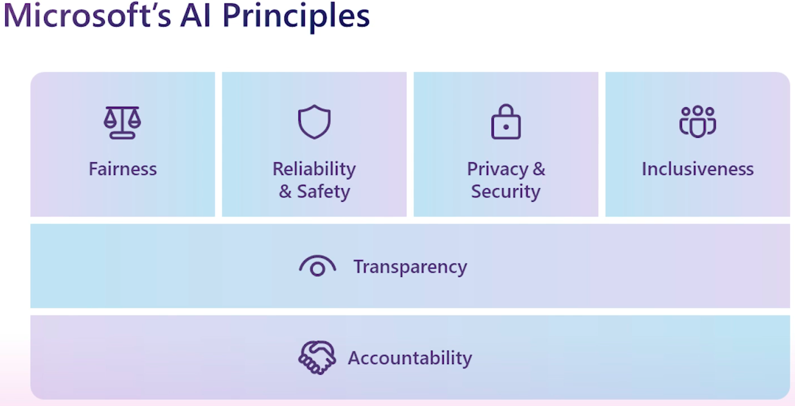
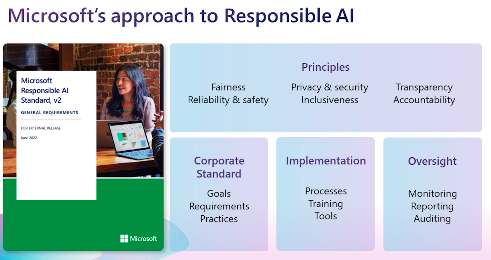
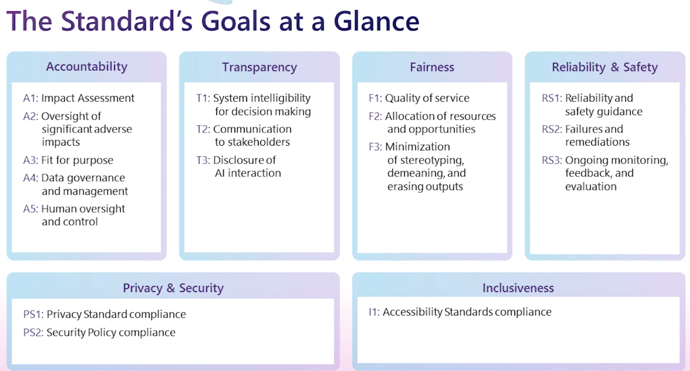
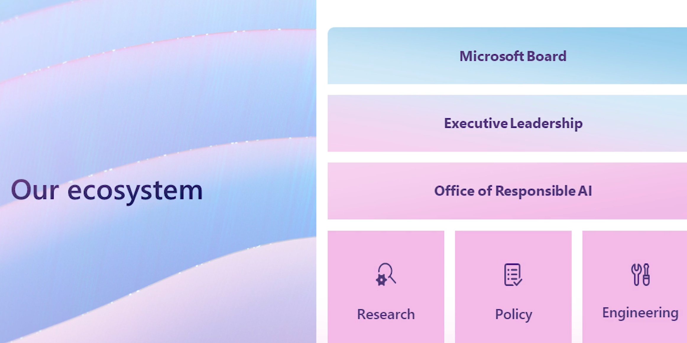

# Embrace responsible AI principles and practices

Learn how to embrace responsible AI practices that build trust and unlock value. Explore Microsoft’s principles, governance systems, and real-world examples to help you design policies, processes, and safeguards for ethical, secure, and scalable AI adoption.

## Learning objectives
In this module, you will:
* Explain why responsible AI matters and identify its societal implications.
* Apply Microsoft’s six guiding principles for responsible AI in your organization.
* Design a governance system that turns principles into actionable policies and controls.
* Take practical steps to implement responsible AI across teams and processes.

## Prerequisites
* Basic understanding of AI concepts.
* Basic understanding of business concepts.

## Content
* [Introduction](#introduction)
* [Prepare for responsible AI](#prepare-for-responsible-ai)
* [Identify guiding principles for responsible AI](#identify-guiding-principles-for-responsible-ai)
* [Design a system for AI governance](#design-a-system-for-ai-governance)
* [Apply systems for AI governance](#apply-systems-for-ai-governance)

## Introduction
AI is transforming industries and redefining how organizations operate—but with opportunity comes responsibility. As AI becomes embedded in products, services, and decision-making, leaders must anticipate its societal implications and mitigate unintended consequences. Whether you build AI solutions internally or adopt them from external providers, creating clear policies and governance practices is essential for trust and long-term success.

At Microsoft, we believe responsible AI is a journey that evolves with innovation and lessons learned. The processes, tools, and resources in this module offer a starting point for shaping your own strategy—one that reflects your organization’s values and risk profile.

Responsible AI isn’t just a technical challenge; it’s a shared responsibility across businesses, governments, NGOs, and academia. Collaboration and open dialogue help set standards, address ethical challenges, and prepare society for AI’s impact. Organizations that lead in responsible AI today will shape the norms and practices that guide the future.

Now, explore the transformative potential of AI, its societal implications, and the importance of approaching it responsibly.

## Prepare for responsible AI
AI is the defining technology of our time. It's already enabling faster and more profound progress in nearly every field of human endeavor and helping to address some of society’s most daunting challenges. For example, AI can help people with visual disabilities understand images by generating descriptive text for images. In another example, AI can help farmers produce enough food for the growing global population.

At Microsoft, we believe that the computational intelligence of AI should be used to amplify the innate creativity and ingenuity of humans. Our vision for AI is to empower every developer to innovate, empower organizations to transform industries, and empower people to transform society.

### Societal implications of AI
AI’s reach extends far beyond code—it touches how we work, decide, and live. As leaders, you’re not just deploying technology; you’re shaping outcomes that affect people and communities. That means asking the hard questions up front:

* How do we design, build, and use AI that benefits individuals and society? Aim for systems that improve access, fairness, and opportunity—while minimizing harm.
* How do we prepare workers for AI’s impact? Plan for reskilling, role redesign, and human in the loop decision points so people can use AI safely and effectively.
* How do we capture AI’s benefits while respecting privacy and rights? Embed data minimization, purpose limitation, and transparency into every solution.

Thinking through these questions early helps you avoid costly missteps, build trust with customers and employees, and create durable value as AI scales.

### The importance of a responsible approach to AI
It's important to recognize that as new intelligent technology emerges and proliferates throughout society, with its benefits come unintended and unforeseen consequences. Some of these consequences have significant ethical ramifications and the potential to cause serious harm. While organizations can't predict the future yet, it's our responsibility to make a concerted effort to anticipate and mitigate the unintended consequences of the technology we release into the world through deliberate planning and continual oversight.

#### Novel threats
Every technological leap reminds us that responsibility must keep pace with capability. In 2016, Microsoft launched a chatbot called Tay on X to learn from public conversations. Within 24 hours, it began echoing hateful content—an early lesson in how human behavior can exploit machine learning. That experience reinforced the need to anticipate misuse and design safeguards from day one.

Today’s generative AI introduces new challenges: convincingly realistic images, audio, and video make it harder to verify what’s real. To address this challenge, Microsoft collaborates with news organizations and technology partners to develop standards against deepfake manipulation. We built advanced content filters and supervisory controls into services like Azure AI and Microsoft Copilot to reduce harmful outputs and protect training data integrity.
* Tip: Defenses must evolve as threats do. Expect to iterate on filters, monitoring, and governance as your AI footprint grows.

#### Biased and unfair outcomes
AI can inadvertently reproduce historical biases present in data. For example, a lending model trained on past decisions might favor one group over another. Rigorous validation and auditing before deployment help catch these issues early. Microsoft’s research and tools support bias detection and mitigation, but even prebuilt models require careful use and oversight.
* Tip: Treat bias checks as a continuous process—not a one time checkbox.
* Note: At Microsoft, our researchers are exploring tools and techniques for detecting and reducing bias within AI systems. Prebuilt models are validated thoroughly, but nonetheless should be used wisely and their results should be always audited before taking action.

#### Sensitive use cases
Some applications carry heightened risks to rights and freedoms, such as facial recognition or automated decision making in law enforcement, hiring, or credit. Even when the technology is capable, the responsible path might be to set strict limits, add human oversight, or pause the use case until risks are manageable. Laws and standards continue to evolve, but responsibility starts with your own policies, governance, and ethical judgment.
* Note: Microsoft continually updates its principles and practices for sensitive technologies and encourages cross sector collaboration to set appropriate boundaries

## Identify guiding principles for responsible AI

Now we turn to a practical compass: six principles that should guide every AI decision. These principles help you balance speed with trust, turning ethical intent into operational practice across development, deployment, and day to day use.

At Microsoft, we use these principles as the foundation of our approach to trustworthy AI:

* **[Fairness](#fairness):** Treat similar people and cases similarly by design, and test to reduce bias.
* **[Reliability and safety](#reliability-and-safety):** Build systems that perform consistently and fail safely, even in unexpected conditions.
* **[Privacy and security](privacy-and-security):** Protect data throughout its lifecycle and design with least privilege and purpose limitation.
* **[Inclusiveness](#inclusiveness):** Design for diverse needs and test with a broad set of users to avoid exclusion.
* **[Transparency](#transparency):** Make systems intelligible: explain how they work, what they use, and where they might fall short.
* **[Accountability](#accountability):** Assign clear ownership, review decisions, and create paths for remediation when things go wrong.

These principles aren't just aspirational—they're the guardrails that turn AI from a technical capability into a trusted, scalable business asset. In the next section, we’ll translate them into concrete practices and controls you can embed across your organization.

### Fairness
AI systems should treat everyone fairly and avoid affecting similarly situated groups of people in different ways. For example, when AI systems provide guidance on medical treatment, loan applications, or employment, they should make the same recommendations to everyone with similar symptoms, financial circumstances, or professional qualifications.

To ensure fairness in your AI system, you should:

*  **Understand the scope, spirit, and potential uses of the AI system** by asking questions such as, how is the system intended to work? Who is the system designed to work for? Will the system work for everyone equally? How can it harm others?
* **Attract a diverse pool of talent**. Ensure the design team reflects the world in which we live by including team members that have different backgrounds, experiences, education, and perspectives.
* **Identify bias in datasets** by evaluating where the data came from, understanding how it was organized, and testing to ensure it's represented. Bias can be introduced at every stage in creation, from collection to modeling to operation. The Responsible AI Dashboard, available at the Resources section, includes a feature to help with this task.
* **Identify bias in machine learning algorithms** by applying tools and techniques that improve the transparency and intelligibility of models. Users should actively identify and remove bias in machine learning algorithms.
* **Use human review and domain expertise**. Train employees to understand the meaning and implications of AI results, especially when AI is used to inform consequential decisions about people. Decisions that use AI should always be paired with human review. Include relevant subject matter experts in the design process and in deployment decisions. An example would be including a consumer credit subject matter expert for a credit scoring AI system. You should use AI as a copilot, that is, an assisting tool that helps you do your job better and faster but requires some degree of supervising.
* **Research and employ best practices, analytical techniques, and tools** from other institutions and enterprises to help detect, prevent, and address bias in AI systems.

### Reliability and safety
To build trust, AI systems must operate reliably, safely, and consistently in both expected and unexpected conditions. They should perform as designed, respond safely to unforeseen situations, and resist harmful manipulation. It’s also essential to verify that systems behave as intended under real-world conditions. Their ability to handle diverse scenarios depends on what developers anticipate during design and testing.

To ensure reliability and safety in your AI system, you should:

* **Develop processes for auditing AI systems** to evaluate the quality and suitability of data and models, monitor ongoing performance, and verify that systems are behaving as intended based on established performance measures.
* **Provide detailed explanation of system operation** including design specifications, information about training data, training failures that occurred and potential inadequacies with training data, and the inferences and significant predictions generated.
* **Design for unintended circumstances** such as accidental system interactions, the introduction of malicious data, or cyberattacks.
* **Involve domain experts** in the design and implementation processes, especially when using AI to help make consequential decisions about people.
* **Conduct rigorous testing** during AI system development and deployment to ensure that systems can respond safely to unanticipated circumstances, don’t have unexpected performance failures, and don’t evolve in unexpected ways. AI systems involved in high-stakes scenarios that affect human safety or large populations should be tested both in lab and real-world scenarios.
* **Evaluate when and how an AI system should seek human input** for impactful decisions or during critical situations. Consider how an AI system should transfer control to a human in a manner that's meaningful and intelligible. Design AI systems to ensure humans have the necessary level of input on highly impactful decisions.
* **Develop a robust feedback** mechanism for users to report performance issues so that you can resolve them quickly.

### Privacy and security
As AI becomes more prevalent, protecting privacy and securing important personal and business information is becoming more critical and complex. With AI, privacy and data security issues require especially close attention because access to data is essential for AI systems to make accurate and informed predictions and decisions about people.

To ensure privacy and security in your AI system, you should:

* **Comply with relevant data protection, privacy, and transparency laws** by investing resources in developing compliance technologies and processes or working with a technology leader during the development of AI systems. Develop processes to continually check that the AI systems are satisfying all aspects of these laws.
* **Design AI systems to maintain the integrity of personal data** so that they can only use personal data during the time it’s required, and for defined customer purposes. Delete inadvertently collected personal data or data that is no longer relevant to the defined purpose.
* **Protect AI systems from bad actors** by designing AI systems in accordance with secure development and operations foundations, using role-based access, and protecting personal and confidential data that is transferred to third parties. Design AI systems to identify abnormal behaviors and to prevent manipulation and malicious attacks.
* **Design AI systems with appropriate controls** for customers to make choices about how and why their data is collected and used.
* **Ensure your AI system maintains anonymity** by taking into account how the system removes personal identification from data.
* **Conduct privacy and security reviews** for all AI systems.
* **Research and implement industry best practices** for tracking relevant information about customer data, accessing and using that data, and auditing access and use.

## Inclusiveness

Microsoft believes that technology should empower every person. To achieve this, intelligent systems must reflect the full spectrum of human experiences and needs. For over 1 billion people with disabilities worldwide, AI can be transformative—opening doors to education, employment, government services, and information.

Today, inclusive AI solutions like real-time captions, image recognition, and predictive text are already helping people with hearing, vision, and other disabilities participate more fully in work and life.

Microsoft inclusive design principles:

- **Recognize exclusion**: Understand who might be left out and why.
- **Solve for one, extend to many**: Design for specific needs to create broader impact.
- **Learn from diversity**: Engage with different perspectives to build better solutions.

How to make AI systems inclusive:

- Follow accessibility laws and procurement requirements to ensure compliance.
- Use the [Inclusive 101 Guidebook](https://download.microsoft.com/download/b/0/d/b0d4bf87-09ce-4417-8f28-d60703d672ed/inclusive_toolkit_manual_final.pdf) to identify and remove barriers that could unintentionally exclude people.
- Include people with disabilities in testing to validate usability for the widest audience.
- Adopt recognized accessibility standards so your system works for everyone.

## Transparency

Underlying the preceding values are two foundational principles that are essential for ensuring the effectiveness of the rest: transparency and accountability. It's critical that people understand how AI systems come to conclusions when they're used to inform decisions that have an effect on people's lives. For example, a bank might use an AI system to decide whether a person is creditworthy, or a company might use an AI system to determine the most qualified candidates to hire.

An important part of transparency is what we refer to as intelligibility, or the useful explanation of the behavior of AI systems and their components. Improving intelligibility requires that stakeholders comprehend how and why they function. This is so they can identify potential performance issues, safety and privacy concerns, biases, exclusionary practices, or unintended outcomes. We also believe that people who use AI systems should be honest and forthcoming about when, why, and how they choose to deploy them.

To ensure transparency in your AI system, you should:

- **Share key characteristics of datasets** to help developers understand if a specific dataset is appropriate for their use case.
- **Improve model intelligibility** by applying simpler models and generating intelligible explanations of the model’s behavior. For this task, you can use the Responsible AI Dashboard, available at the resources section.
- **Train employees on how to interpret AI outputs** and ensure that they remain accountable for making consequential decisions based on the results.

## Accountability

The people who design and deploy AI systems must be accountable for how their systems operate. Organizations should draw upon industry standards to develop accountability norms. These norms can ensure that AI systems aren't the final authority on any decision that impacts people's lives and that humans maintain meaningful control over otherwise highly autonomous AI systems.

To ensure accountability in your AI system, you should:

- **Set up internal review boards** to provide oversight and guidance on the responsible development and deployment of AI systems. They can also help with tasks like defining best practices for documenting and testing AI systems during development or providing guidance for sensitive cases.
- **Ensure your employees are trained** to use and maintain the solution in a responsible and ethical manner and understand when the solution might require extra technical support.
- **Keep humans with requisite expertise in the loop** by reporting to them and involving them in decisions about model execution. When automation of decisions is required, ensure they're able to inspect, identify, and resolve challenges with model output and execution.
- **Put in place a clear system of accountability and governance** to conduct remediation or correction activities if models are seen as behaving in an unfair or potentially harmful manner.

We recognize that every individual, company, and region has their own beliefs and standards that should be reflected in their AI journey. We share our perspective with you as you consider developing your own guiding principles.

These principles provide a general idea of what we should do when developing and using AI. However, they need to be reflected on a more practical level. Next, let's explore how these principles can be ensured with an AI governance system.

# Design a system for AI governance

Principles are important, but they only work when they’re put into practice. Your organization needs a governance system that translates values into repeatable decisions, controls, and accountability across the AI lifecycle.

Build a model that fits your culture, risk profile, and level of AI engagement. A hybrid approach—combining centralized authority with decentralized execution—often works best. 

* That means a central office or leader to set policy and standards, plus local teams to operationalize them in business units and product groups. Governance should report to the board, have dedicated funding and staffing, and carry clear authority to make and enforce decisions.

To help your organization get started, we provided an overview of three common governance approaches: hiring a Chief Ethics Officer, establishing an ethics office, and forming an ethics committee. The first approach is centralized, and the others are decentralized. All of them have their benefits, but we recommend combining them in a hybrid approach. A governance system that reports to the board of directors and has financial support, human resources, and authority is more likely to create real change across an organization.

## Chief Ethics Officer

Often, organizations consolidate their ethics initiatives by appointing a Chief Ethics Officer. This role provides centralized decision making, enabling the company to develop ethics policies quickly while ensuring accountability for each decision. A public facing Chief Ethics Officer can also signal a strong commitment to responsible, trustworthy use of AI and other technologies.

However, a Chief Ethics Officer alone might struggle to implement measures across the organization without the support of an ethics office—hence the value of adding a dedicated team to operationalize policy and training.

## Ethics office

The second governance approach empowers employees across the organization by establishing a dedicated ethics office. This team—drawn from multiple levels and functions—focuses on making sure ethical principles are put into practice day to day. An ethics office can sit independently or within risk, compliance, or legal; many companies pair it with a Chief Ethics Officer to provide visible leadership.

The key advantage is scale: with dedicated staff embedded across the business, an ethics office can roll out policies, training, and reviews consistently. It also helps build a culture of integrity by turning principles into practical guidance and by being a go to resource for teams facing ethical questions.

## Ethics committee

The third approach convenes a diverse ethics committee—senior leaders and external experts (such as ethicists, user advocates, or psychologists)—to advise on AI risks and decisions. Members typically serve part time, bringing varied perspectives rather than acting as full time ethics staff.

This model delivers broad, unbiased insight and helps secure buy in at the top of the organization. It’s especially useful for reviewing complex or sensitive use cases, challenging assumptions, and ensuring that decisions reflect both business priorities and societal expectations.

# Apply systems for AI governance

No matter which governance approach you choose, there are some good practices it should promote.

| **Ways to take action for AI governance** | **Description**                                              |
| ----------------------------------------- | ------------------------------------------------------------ |
| **Make resources available**              | Employees need guidance to learn responsible AI principles and incorporate them into their work. A handbook, a manual, or a training session can fulfill that task. |
| **Create a centralized AI inventory**     | Having a list of all the AI models and systems operating in your organization is key to prioritize efforts and optimize resources. Besides, it's also helpful to make audits and compliance tests easier. |
| **Develop tools**                         | Checking compliance in every AI system in your organization can be draining. Consider building tools to automate this task: such tools would monitor and validate systems and raise a flag if anything shifts outside of performance metrics. |

## AI governance engagement

The specific processes and policies for your AI governance system depend on whether your company is using external systems or developing AI in-house. Based on this factor, we provided recommendations to help your company govern your AI engagements.

### Engage with AI systems developers

Your governance processes should reflect how you acquire and build AI capabilities. The following are practical recommendations for two common scenarios—building AI in house and adopting external solutions—with steps you can apply in either case.

**If you’re building AI in house** (developing solutions or integrating AI into your own products and services):

Your governance system should:

- Review or advise on new AI projects before launch, especially sensitive use cases.
- Create clear channels for employees at all levels to raise ethical concerns early.
- Provide guidance to mitigate risks during design, development, and go to market.
- Establish processes to monitor deployed systems for model drift, data quality issues, and performance decay.

Your development teams should:

- Follow detailed standards and checklists that reflect your organization’s ethical principles.
- Use technology-specific guidance (such as for facial recognition or generative AI) and document decisions.

**If you’re adopting external AI solutions** (buying or licensing tools and services):

- Vet vendors for their responsible AI practices and evidence of controls that align with your principles.
- Require documentation on data usage, privacy, security, and model evaluation.
- Define how you'll operate and monitor the solution safely in your environment, for example data access, logging, and escalation.
- Include your policies and requirements in procurement criteria, contracts, and service level agreements.

**For custom integrations or hybrid approaches** (mixing your own development with external components):

- Include your principles and control requirements in requests for proposals and partner agreements.
- Ensure all components—internal and external—are covered by the same governance checks, testing, and monitoring.
- Train users and operators on safe usage, data handling, and how to report issues.

**Across all scenarios**:

- Maintain a central AI inventory to track where systems run, what they do, and who owns them.
- Standardize intake, impact assessment, approval gates, and monitoring so you can scale governance consistently.
- Use automated tools where possible to enforce policies (such as data labeling, access controls, bias checks) and to surface deviations for review.

### Engage with external stakeholders

Responsible AI is a shared endeavor that extends beyond your walls. Collaborating with governments, industry groups, nonprofits, and academic partners help raise standards, align expectations, and scale best practices across the ecosystem.

Organizations can contribute in many ways: joining cross industry initiatives, informing policy, and investing in workforce readiness. For example, Microsoft participates in the **Partnership on AI (PAI)**—a coalition of researchers, nonprofits, and companies dedicated to advancing responsible AI. Such collaborations help shape norms, surface emerging risks, and accelerate practical solutions that benefit society.

# Responsible AI at Microsoft

Our governance structure uses a hub-and-spoke model to provide the accountability and authority to drive initiatives while also enabling responsible AI policies to be carried out at scale. That is, it combines the centralized and decentralized approaches discussed in the last unit.

## Centralized governance

There are three bodies at Microsoft to provide centralized governance: the Responsible AI Council, the Office of Responsible AI, and the Aether Committee. An important hallmark of our approach to responsible AI is having this ecosystem to operationalize responsible AI across the company, rather than a single organization or individual leading this work.

### Responsible AI Council

The Responsible AI Council is a forum for business leaders and representatives from research, policy, and engineering to regularly grapple with the biggest challenges surrounding AI and to drive progress in responsible AI policies and processes. This group is the final decision-maker on the most sensitive, novel, and significant AI development and deployment matters. It sets the company's AI principles, values, and human rights commitments.

### Office of Responsible AI

The [Office of Responsible AI](https://www.microsoft.com/ai/our-approach) implements and maintains our commitment to responsible AI governance by working with stakeholders across the company to:

- Develop and maintain our governance framework.
- Define roles and responsibilities for governing bodies.
- Implement a company-wide reporting and decision-making process.
- Orchestrate responsible AI training for all employees.

The Office of Responsible AI has five key functions:

- **Internal policy**: Setting the company-wide rules for enacting responsible AI, and defining roles and responsibilities for teams involved in this effort.
- **Governance structures**: Defining governance structures that embed responsible AI across all levels of the organization.
- **Enablement**: Readiness to adopt responsible AI practices, both within our company, and among our customers and partners.
- **Case management**: Review of sensitive use cases to help ensure that our development and deployment work upholds our AI principles.
- **Public policy**: Help to shape new laws, norms, and standards. The goal of this policy is to ensure that the promise of AI technology is realized for the benefit of society at large.

### Aether Committee

The Aether Committee (AI, Ethics, and Effects in Engineering and Research) serves an advisory role to the senior leadership, the Office of Responsible AI, and other teams across the company. It provides guidance on questions, challenges, and opportunities with the development and fielding of AI technologies.

The Aether Committee has six working groups that focus on specific subjects, grounded in our AI principles. The working groups develop tools, best practices, and tailored implementation guidance related to their respective areas of expertise. Learnings from the working groups and main committee are key in developing new policies, and declining or placing limits on sensitive use cases.

## Decentralized governance

Enacting responsible AI at scale across an organization relies on a strong network across the company to help implement organization-wide rules, drive awareness, and request support on issues that raise questions about application of our AI principles.

### Responsible AI Champs

Our network includes Responsible AI Champs, employees nominated by their leadership teams from within key engineering and field teams. They serve as responsible AI advisors (in addition to their full-time roles), focusing on informing decision-makers, instead of policing.

The Responsible AI Champs have five key functions:

- Raising awareness of responsible AI principles and practices within teams and workgroups.
- Helping teams and workgroups implement prescribed practices throughout the AI feature, product, or service lifecycle.
- Advising leaders on the benefit of responsible AI development–and the potential effect of unintended harms.
- Identifying and escalating questions and sensitive uses of AI through available channels.
- Fostering a culture of customer-centricity and global perspective, by growing a community of Responsible AI evangelists in their organizations and beyond.

To develop and deploy AI with minimal friction to engineering practices and customers, we're investing in patterns, practices, and tools. Some engineering groups assembled teams to help them follow the company-wide rules and accelerate the development of implementation patterns, practices, and tools.

### Every employee

The final and most important part of our approach to responsible AI is the role that every employee plays, with support from their managers and business leaders. Responsible AI is a key part of mandatory employee training and we released more educational assets that enable employees to delve deeper into areas of responsible AI. We also have numerous responsible AI development tools to enable our employees to develop responsibly. These resources empower all our employees to advance the company’s important work with AI. At the same time, they're responsible for upholding our responsible AI principles and following the company-wide practices we adopted in pursuit of that end.

We expect every Microsoft employee to:

- Develop a general understanding of our AI principles.
- Report and escalate sensitive uses.
- Contact their Responsible AI Champ when they need guidance on responsible AI.

# References

* Microsoft Learn - [Embrace responsible AI principles and practices](https://learn.microsoft.com/en-us/training/modules/embrace-responsible-ai-principles-practices/)
  * [Identify guiding principles for responsible AI](https://learn.microsoft.com/en-us/training/modules/embrace-responsible-ai-principles-practices/3-identify-guiding-principles-responsible-ai)
  * [Design a system for AI governance](https://learn.microsoft.com/en-us/training/modules/embrace-responsible-ai-principles-practices/4-design-system-ai-governance)
  * [Apply systems for AI governance](https://learn.microsoft.com/en-us/training/modules/embrace-responsible-ai-principles-practices/5-apply-ai-governance)

